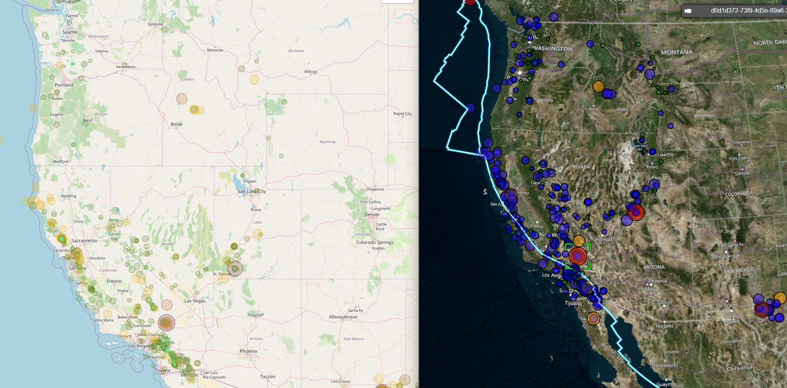

# M15-let-leaf-quake-earth
🚧***Turning this in because I'm tired of it being late***🚧

I gotta say that I'm enjoying javascript. VS Code's autocomplete certainly made quick work of this, but I plan to clean this up as a portfolio piece (more loops, better dashboard, etc). 

Part 1: Create the Earthquake Visualization >>> <a href='https://famndox.github.io/M15-let-leaf-quake-earth/leaflet-part-2/index.html'>Click Here!!!</a> 
-
Successfully uses <a href='https://earthquake.usgs.gov/earthquakes/feed/v1.0/geojson.php'>USGS GeoJSON Feed</a> to plot Earthquake data using 

Thanks to the nice folks at OpenStreetMap for being 'principly happy' supporting nobodies like me. 

https://operations.osmfoundation.org/policies/tiles/#:~:text=We%20are%20in-,principle%20happy,-for%20our%20map

<a href='https://famndox.github.io/M15-let-leaf-quake-earth/leaflet-part-2/index.html'>Click Here!!!</a> 
<a href=''>P3-jellyRoots.git</a> 
<a href=''>P3-jellyRoots.git</a> 
